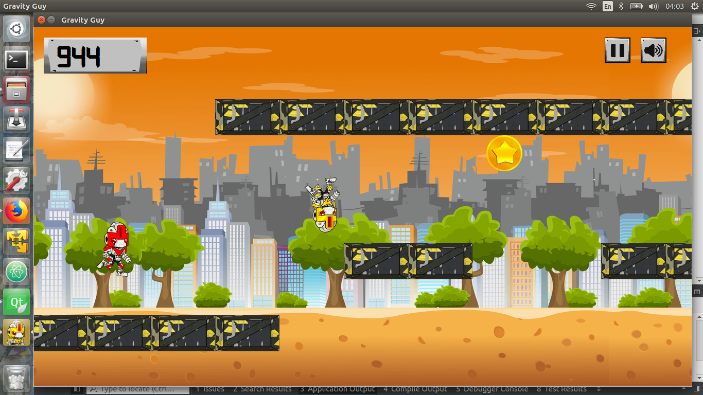

# RS002-gravity-guy


This is an arcade game made with C++ and Qt5.


## Usage

<table>
  <tr>
    <th colspan="2">Global</th>
  </tr>
  <tr>
    <td>Change gravity</td><td>Space</td>
  </tr>
</table>


## Setup

1. Clone

    ```sh
	git clone https://github.com/MATF-RS19/RS002-gravity-guy.git

    ```

2. Import to Qt creator

    ```sh
	File->Open file or project->main.pro

    ```
3. Build and run

***
## Contact

Marija Filipovic – [@Linkedin](https://www.linkedin.com/in/marija-filipovic/) – marija-filipovic@outlook.com
Lazar Bojanic - [@Linkedin](https://www.linkedin.com/in/lbojanic/) - lazar.bojanic@hotmail.rs

